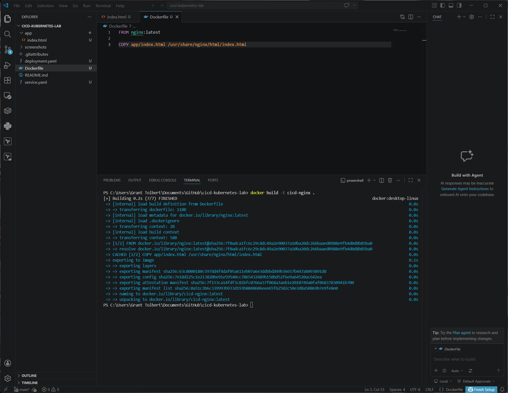
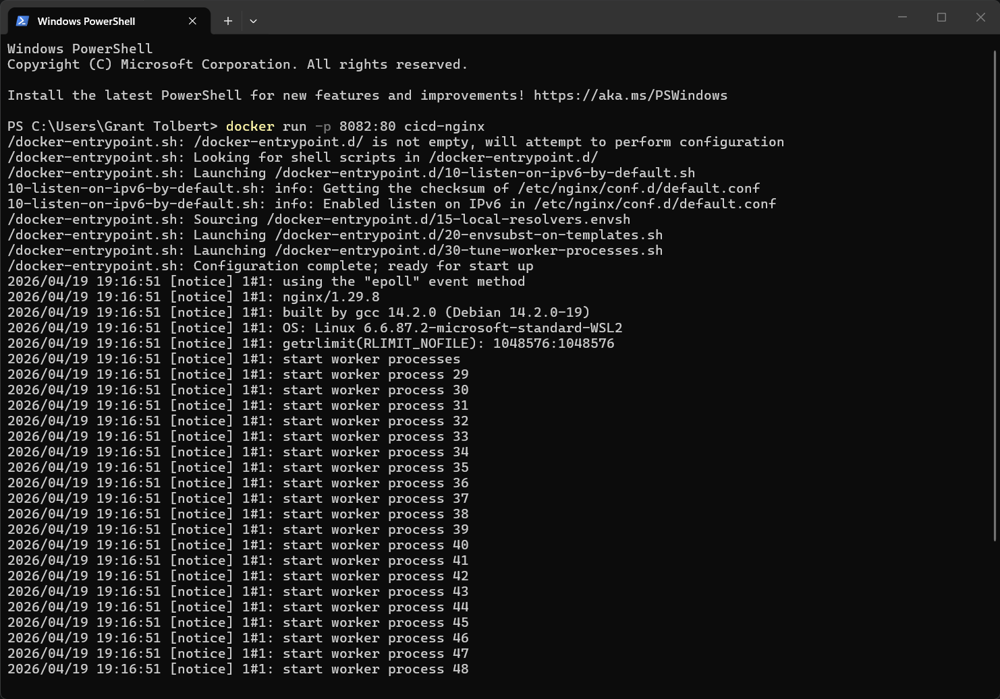
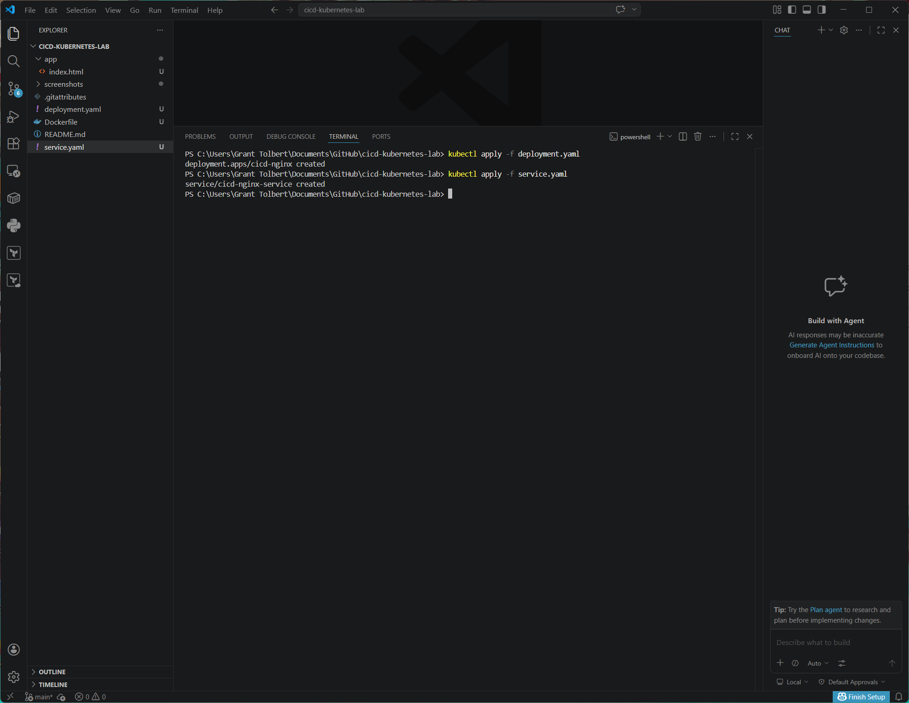
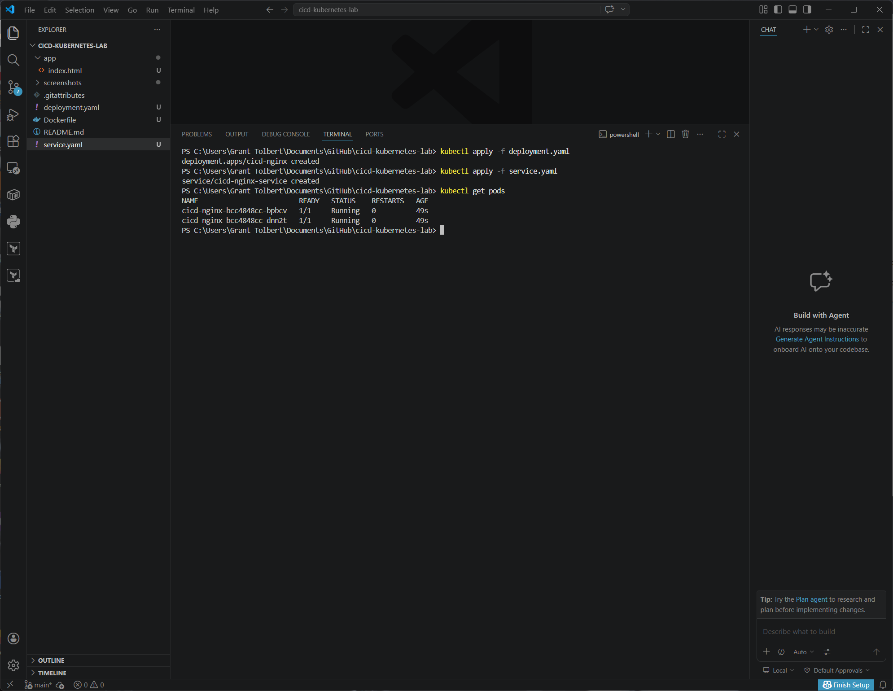
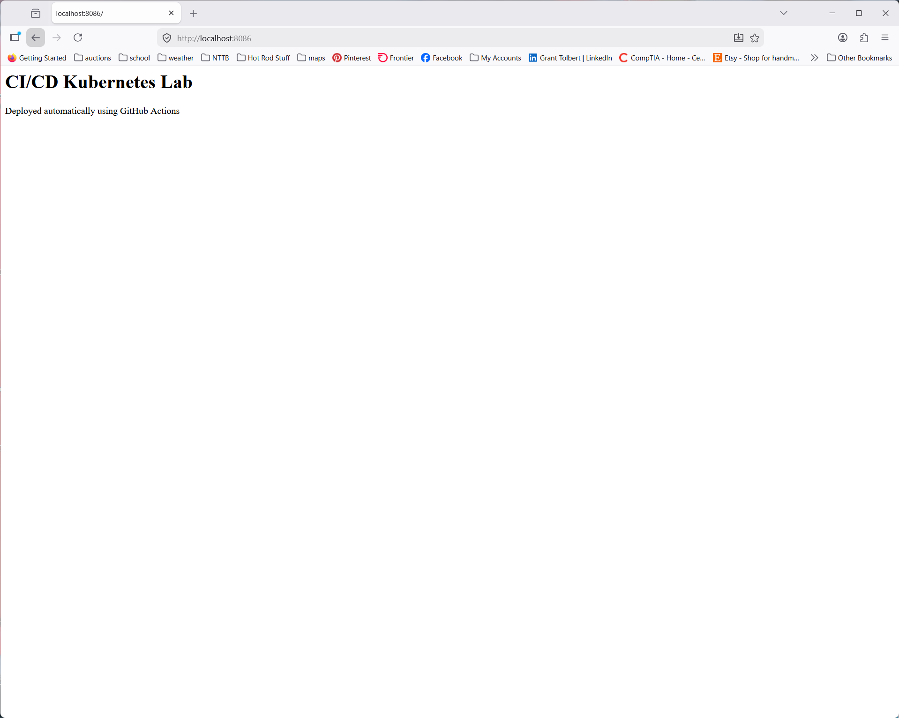
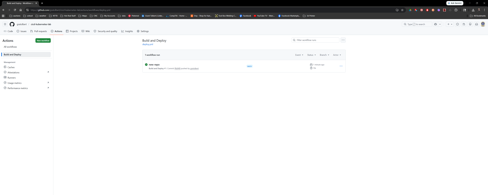
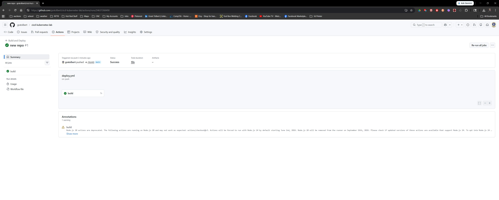

# CI/CD Kubernetes Lab

Automated container build and deployment pipeline using GitHub Actions, Docker, and Kubernetes.

---

# Overview

This project demonstrates a basic CI/CD pipeline that automatically builds a Docker container image using GitHub Actions and deploys the application to a Kubernetes cluster.

The lab simulates a simplified DevOps workflow where code committed to a GitHub repository triggers an automated build pipeline.

---

# Architecture

Developer Commit
↓
GitHub Repository
↓
GitHub Actions CI Pipeline
↓
Docker Image Build
↓
Kubernetes Deployment

---

# Technologies Used

GitHub Actions
Docker
Kubernetes
kubectl
NGINX
Docker Desktop Kubernetes
Windows 11 / WSL
Visual Studio Code

---

# Project Structure

cicd-kubernetes-lab

app
└── index.html

Dockerfile
deployment.yaml
service.yaml

.github
└── workflows
  deploy.yml

README.md

screenshots

---

# Application

The application is a simple static webpage served using NGINX.

app/index.html

Example output:

CI/CD Kubernetes Lab
Deployed automatically using GitHub Actions

---

# Docker Configuration

Dockerfile

The Dockerfile builds a container image using the NGINX base image and copies the web application into the NGINX web root.

Key steps

Base image: nginx:latest
Copy application files into container

---

# Kubernetes Deployment

deployment.yaml

Creates a Kubernetes Deployment with two NGINX pods.

Key configuration

Replicas: 2
Container image: cicd-nginx
Container port: 80

---

# Kubernetes Service

service.yaml

Exposes the application using a NodePort service.

Service type

NodePort

NodePort

30008

---

# GitHub Actions Workflow

.github/workflows/deploy.yml

The CI pipeline runs automatically when code is pushed to the main branch.

Pipeline steps

1. Checkout repository
2. Build Docker container image

This simulates a continuous integration workflow.

---

# Commands Used

Build Docker image

docker build -t cicd-nginx .

Run container locally

docker run -p 8082:80 cicd-nginx

Deploy to Kubernetes

kubectl apply -f deployment.yaml
kubectl apply -f service.yaml

View pods

kubectl get pods

Port forward application

kubectl port-forward service/cicd-nginx-service 8086:80

Access application

http://localhost:8086

---

# Screenshots

Docker image build

Local container test

Kubernetes deployment

Pods running

Application running in Kubernetes

GitHub Actions pipeline success

GitHub Actions build steps

---

# Key Concepts Demonstrated

CI/CD automation
GitHub Actions pipelines
Docker container builds
Kubernetes deployments
Infrastructure automation
DevOps workflow integration

---

# Author

Grant Tolbert
Cloud Infrastructure Engineering Portfolio

